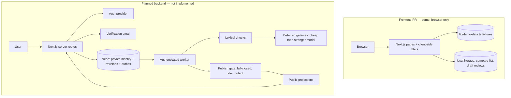

# Student Rankz — Architecture

**Purpose:** orient engineers and coding agents on what this repository implements today versus the planned backend integration. Not a specification; no SQL or API described here is live. Provisioning steps: [BACKEND-SETUP.md](./BACKEND-SETUP.md). Frontend conventions: [FRONTEND.md](./FRONTEND.md) — that file arrives in its own PR, so this link resolves only after both are merged.

## Frontend prototype (separate PR)

This describes the frontend PR; it is not yet merged into the default branch.

- Next.js 16.3.5 (App Router) with React 19, Tailwind CSS 4 and shadcn-based components.
- Routes: `/`, `/universities`, `/universities/[id]`, `/courses`, `/courses/[id]`, `/instructors/[id]`, `/compare`.
- In-repo demo fixtures (`lib/demo-data.ts`) for universities, courses and instructors; search and filters run client-side over them.
- Browser-only state in `localStorage` (via `hooks/use-local-storage.ts`): the compare list and private draft reviews.
- **No backend exists yet:** no database, no accounts or login, no email verification, no moderation, no server-side persistence. Fixtures are illustrative, not real institutions' current data.

## Planned backend (not implemented)

- **Database:** one Neon Postgres app database, EU region (Frankfurt). Private tables hold identity, affiliations and review ownership; public pages read explicit, privacy-safe projections only.
- **Authentication:** provisional choice Neon Auth (managed authentication built on Better Auth), pending day-1 checks; fallback is self-hosted Better Auth against the same database. Login (personal email) stays separate from affiliation.
- **Affiliation verification:** an independent layer — per-university approved exact email domains, single-use account-bound codes with expiry. Proves mailbox control only, never enrollment, attendance or one person per mailbox.
- **Reviews:** immutable revisions; each admission writes the revision and its moderation job in one transaction (transactional outbox).
- **Moderation (deferred until a gateway is available):** planned local lexical checks, then a cheap gateway model, escalating uncertain/serious cases to a stronger model. Public submission/publication stays disabled until this pipeline is implemented. Fail-closed on timeout, malformed output or outage; publication is idempotent and re-checks deletion and eligibility; deletion wins over in-flight jobs.
- **Directory model:** programme-specific course status (required/elective belongs to the programme–course relation), dated offerings, and multiple instructors per offering.
- **Jobs:** an authenticated scheduled worker; all secrets server-side only.

## System shape

The halves are intentionally disconnected: browser state never feeds the future server flow without full re-validation through the submission path.

## Trust boundaries

- `localStorage` content is non-authoritative; a draft becomes a server review only through normal submission and moderation.
- Public routes, payloads, errors and logs must not expose identity, emails, HMACs, or pending/rejected text.
- Moderation and publication run server-side; the client cannot bypass or pre-approve them.
- Verification codes are single-use, account-bound and short-lived; passing verification never grants login or account recovery, and one university's affiliation never authorizes another university's reviews.
- Model verdicts are advisory; anything unverified or errored stays unpublished.
- Identity data lives in private tables; public projections carry opaque references only.

## Gap list (what needs implementing)

1. Database schema, migrations, and a server data layer replacing fixtures.
2. Authentication integration and session handling.
3. Affiliation verification: domain allowlist, code issue/verify, expiry.
4. Review submission with immutable revisions, outbox worker and publish gate.
5. Privacy-safe public projections, with tests for each boundary above.
6. Reports/appeals and restricted administrative controls before public launch. No hired moderation team is required for the prototype.

Keep the initial deployment small: one Neon project, synthetic development data, and temporary preview branches only when needed. See the setup guide for free-plan eligibility. Student-experience ratings describe voluntary feedback; they are not accreditation or objective academic rankings. Public anonymity does not mean the operator cannot associate reviews with private accounts.
