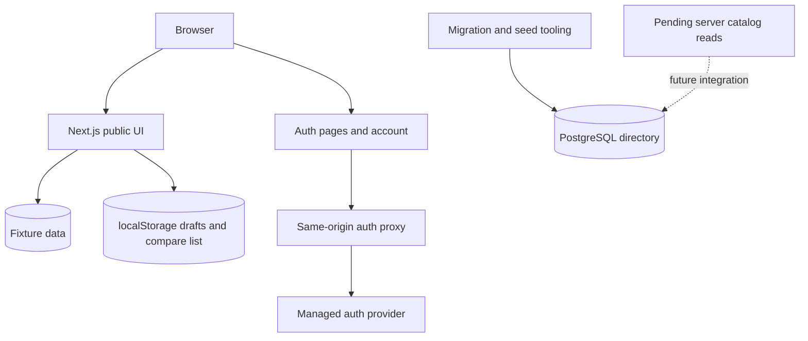

# Student Rankz architecture

This document records the current boundary between the public demo and the backend slices. It is an implementation map, not a promise that every planned flow exists.

## Current components

The Next.js app serves public fixture-backed catalog pages and a fixture-backed rankings page. The review composer stores drafts in browser `localStorage`. These paths remain independent of the database.

The database slice provides a typed PostgreSQL directory schema, committed Drizzle migration, server-only lazy access through `server/db.ts`, and a repeatable synthetic seed. The seed contains fictional universities, programmes, courses, offerings, and instructors. It is explicitly invoked for a named development or demo scope and is never run by build, migration, or deploy.

The auth slice provides managed Neon Auth routes, sign-in/sign-up/account UI, a same-origin auth proxy, and `getVerifiedSession()` in `lib/auth/server.ts`. It is independently configured from the application database. A provider user is not yet an application identity and does not automatically receive affiliation, ownership, or publication rights. Read [AUTH.md](./AUTH.md) for the exact SDK and session boundary.

## Pending integration boundaries

Catalog and database reads, controlled search/pagination, and honest missing-config/empty/outage/demo states are owned by a later worker. The current public UI must not be described as database-backed.

University affiliation, application identity mapping, private server-side drafts, and their authorization rules are also pending. Do not invent routes or SQL interfaces for those features in dependent documentation. Public posting, moderation, publication, live score aggregation, reports, and admin controls remain deferred.

The fixture and browser paths do not feed server records. A future server write must revalidate identity, ownership, target IDs, and privacy at its own boundary. Private drafts require login; university-restricted operations additionally check affiliation. Public publication remains disabled until moderation exists.

## Data and trust rules

- Public responses must never expose provider credentials, session material, private account identity, draft ownership, verification codes, or unpublished text.
- Public anonymity is separate from operator-held account identity.
- Authentication alone is not authorization for another user's resource or a university-restricted action.
- Production must not receive synthetic rows. A demo branch may receive only the explicit fictional seed.
- A Neon branch copies existing auth identities and configuration from its parent. Development, preview, and test branches must derive from synthetic parents, never from production identities.

## Integration order

The database foundation and auth source changes are preserved as independent commits before the final wiring. The source checkpoints are database `e26e7ad4868683e9eaa4b83ea9eb194cc2acf31b`, auth `5fb5bc2c069f8a50ec453ac02885170dc993dcda`, and UI `d05e80a6a88e2e0fb489bb13c3a65639f99d849e`. The user merges source PRs first. After those land, reconcile the integration work against the updated `main` with a normal merge where permitted or a fresh final glue branch, avoiding duplicate squashed cherry-picks. Agents do not merge, force-push, or deploy.

See [BACKEND-SETUP.md](./BACKEND-SETUP.md) for local configuration and [INTEGRATION.md](./INTEGRATION.md) for the final checkpoint and release gates.
