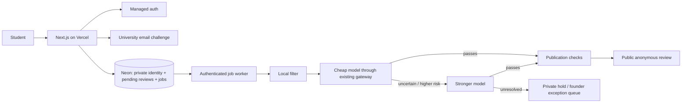

# Student Rankz: one-week EU MVP plan

**Current recommendation · 19 September 2026**  
**Scope:** EU-wide university, programme/course and instructor feedback; AI-assisted build, existing AI gateway, no routine hired moderation team.

**Build a focused MVP in one week as an experiment.** This is a credible target for a small working product, conditional on available engineering attention, provider access and scope control. It is not a forecast of millions of users or a promise that all European institutional/legal edge cases will be solved in seven days.

This replaces the earlier Germany-first, 8–12-week, staffed-pilot recommendation. Its research remains available in the [historical appendix](RESEARCH-APPENDIX.md); those larger operating assumptions are not prerequisites for this MVP.

## 1. What makes it worth trying?

Students need useful information about courses and teaching. A multilingual product can serve students choosing electives and students preparing for compulsory courses. The same product must support both, without assuming every country has US-style instructor selection.

**Academic flexibility:** Store university → programme context → course/module → dated offering/group, with optional many-to-many instructor assignments. Whether a course is compulsory, a constrained option or a free elective belongs to the programme/curriculum version. Students may have course choice without instructor choice. Keep instructor selection optional; use course reviews for preparation even when students cannot change their timetable.

Examples from official curricula: [TUM Informatics](https://www.cit.tum.de/en/cit/studies/degree-programs/bachelor-informatics/) combines required foundations and electives; [KTH Systems, Control and Robotics](https://www.kth.se/en/studies/master/systems-control-robotics/courses-for-systems-control-and-robotics-1.268326) distinguishes mandatory and elective study within tracks; [Bologna Informatics](https://corsi.unibo.it/laurea/informatica/insegnamenti/piano-didattico) publishes programme/year-specific study plans; [Sorbonne Informatics](https://sciences.sorbonne-universite.fr/formation-sciences/licences/licences-generales/licence-dinformatique) uses programme pathways. These are programme examples, not universal rules for their countries. Confirm current local rules during catalogue curation.

This is worth a low-cost build-and-test cycle. There is not enough evidence to predict a high likelihood of major adoption. Existing alternatives include [Profrate](https://profrate.de/), [StudyCheck](https://www.studycheck.de/), [EDUopinions](https://www.eduopinions.com/), official survey products and informal student groups.

**The question to test:** do students prefer our information enough to use it and contribute?

A beautiful empty directory is not useful. Successful recruitment must produce several recent reviews in contexts students actually search.

## 2. EU scope without a Germany assumption

The directory and data model support EU institutions. Interface locale, teaching language and review language are separate. Start with a reusable translation system and AI-assisted UI translations checked on the core flows; do not treat an untranslated or untested language as fully supported.

Initially allow public submissions only in languages passing a small meaningful moderation evaluation and with an escalation path. Use the stronger model for difficult language/context cases; unsupported cases remain private.

Recruit wherever we have student access: university societies, exchange/Erasmus communities, programme groups and personal networks. Begin with several communities that agree to participate, regardless of country. No mass unsolicited messages, fake reviews or copied competitor content.

This is an EU-wide product with initially uneven coverage, not a Germany-only product. Show coverage honestly. Enable posting for institutions only after their verification route is approved.

## 3. The one-week feature set

| Build                               | Keep simple                                                                                         |
| ----------------------------------- | --------------------------------------------------------------------------------------------------- |
| University/course/instructor search | Postgres search and aliases; no separate search cluster.                                            |
| Institution and course pages        | University-experience ratings, useful course context and review counts; transparent comparisons.                                             |
| Course and instructor relationships | Courses can have multiple teachers and offerings; required/elective belongs to a programme context. |
| Managed login                       | Personal or institution email; no custom password system.                                           |
| Independent university verification | Short-lived account-bound email code for an approved exact domain.                                  |
| Structured review + short text      | Distinct university and course/teaching dimensions; shared review infrastructure, no appearance/popularity ratings.  |
| Publicly anonymous display          | No name, email, public author history or precise publication timestamp.                             |
| Mandatory two-tier AI moderation    | Durable pending state, cheap assessment, stronger escalation and fail-closed errors.                |
| Edit/withdraw/report                | Edits undergo new checks; deletion wins against delayed publication.                                |
| Minimal admin page                  | Pending/error cases, reports, factual corrections, model decisions and a publication pause.         |

**University ratings are part of the MVP.** Rate teaching experience, student support, facilities, administration and value, with “not applicable” allowed. Separate university, programme/course and instructor targets so a lecturer review does not silently alter the whole university's score.

Provide university comparisons and a student-experience ranking once enough genuine reviews exist. Proposed initial threshold: 20 distinct verified contributors per university before a ranked score; this is a product assumption to test, not proof of representativeness. Show counts and recency, publish the scoring method, and avoid letting two five-star reviews outrank a large established sample. Do not present voluntary student opinions as objective academic/research quality. Empty institutions can remain discoverable without a score.

Exclude general university discussion channels, direct messages, attachments, paid features, instructor reply threads and advanced analytics. For now, a “university channel” is its scoped course/review directory.

## 4. Lean architecture

**Next.js + TypeScript + Tailwind/shadcn + next-intl on Vercel Pro; Neon Postgres with Drizzle.**

Use a managed auth service that fits the chosen privacy and budget requirements, selected during the first-day integration check. Keep university verification independent of the login provider. Reuse the user's existing gateway instead of buying a second model-routing product; the gateway's exact provider/configuration still needs confirmation during implementation.

A single app and database are sufficient for the MVP. Separate private identity/ownership tables from public content and enforce restricted access with database roles, server authorization and explicit public projections. Do not expose private tables through browser-accessible APIs. Keep mail HMAC keys outside the database.

This separation is weaker against complete application compromise than an independent vault service. Accept that explicit MVP tradeoff; do not claim zero-knowledge or operator-proof anonymity. An independent identity service can follow when the actual threat model justifies it.

The filter produces flags; it does not independently authorize publication. Save each admitted revision and its job atomically. Use bounded workers with durable job status, retries and a scheduled recovery path; never depend on a detached promise after the request ends. [Transactional outbox pattern](https://docs.aws.amazon.com/prescriptive-guidance/latest/cloud-design-patterns/transactional-outbox.html), [Vercel Cron guidance](https://vercel.com/docs/cron-jobs/manage-cron-jobs).

Provider timeouts, invalid model responses, stale revisions and deleted reviews must not publish. Use idempotent submission/worker operations, model/policy version records and spend caps.

## 5. Verification and source data

Use [ROR's CC0 dataset](https://ror.readme.io/docs/data-dump) for institution seeds and [Hipo's domain list](https://github.com/Hipo/university-domains-list) as candidates. Neither is a complete validated student-email registry. Preserve source attribution/licence requirements and aliases.

Approve exact email domains using official university evidence. No automatic wildcard acceptance, guessed domains or mail-provider inference. Unknown domains can be requested privately, then curated.

Examples: [TUM IT](https://www.it.tum.de/en/it/students/) confirms @tum.de and describes students, employees and guests. [UCF's official migration FAQ](https://it.ucf.edu/wp-content/uploads/sites/7/2023/08/SEM-FAQ.pdf) documents student migration to @ucf.edu. UCF is an explanatory US example, not EU coverage.

**Mailbox access proves access to a mailbox.** It does not prove current enrollment, one human per account, course attendance or truthful feedback. If current-student-only membership is mandatory, require a supported institutional student-role assertion and keep unsupported institutions read-only. This affects reach more than the choice of frontend framework.

For the first release, recommend the honest label **“university email verified”**, a first-hand participation declaration and abuse controls. Treat this as a proposed change to the original stronger promise, not as an equivalent guarantee.

Course/instructor records must have provenance and a correction path. Begin with a modest permitted catalogue and moderated suggestions; do not attempt a Europe-wide staff/course scraper in week one. Legacy [ETER terms](https://eter-project.com/about/data-protection/legal-notice/) restrict online redistribution; current EHESO/WHED reuse clearance remains unresolved.

## 6. AI moderation without a hired review team

1. Run local profanity/PII/evasion checks.
2. Send every admitted submission and revision to the cheap model.
3. Escalate ambiguous, serious or unsupported-language cases to the stronger model.
4. Publish only after a completed assessment and application-level privacy/eligibility checks.
5. Hold unresolved cases; founder handles exceptional reports and legal/privacy complaints.

Do not use a model's claimed confidence alone to decide escalation. Use policy categories, lexical flags, schema validity, evaluation results and observed error patterns. Neither model gets tools, identity records or publication authority.

Allow legitimate negative teaching criticism. Hold identifying details, serious accusations and uncertain threats for appropriate handling. A larger model can assess language and policy, but cannot determine whether a real-world accusation is true.

No salary for routine manual review is assumed. The founder samples outcomes during launch and handles exceptions. If the exception rate becomes large, tighten scope or revisit operations based on actual data.

Build a small multilingual evaluation set and inspect errors before opening each language. Test mixed languages, slurs in context, coded abuse, strong legitimate criticism, identifying anecdotes and prompt injection. “A bigger model approved it” is not a quality measurement.

Provide restriction reasons and a report/appeal route. Qualifying small platforms have exemptions from some additional DSA platform duties; this is not a requirement for a human to inspect every review. Applicable hosting duties and exceptional legal matters still need an accountable operator. [DSA official text, Articles 16–20](https://eur-lex.europa.eu/eli/reg/2022/2065/oj/eng).

## 7. Anonymity and minimum launch safeguards

Promise **public anonymity**, not “100% anonymous” or “100% real feedback.”

Keep account links private, avoid precise public time/context that identifies individuals, and warn students about self-identifying anecdotes. Suppress unsafe small-cohort views and score breakdowns. Never return identity fields in public APIs, page payloads, errors or analytics.

Use single-use account-bound verification codes, rate limits, secure sessions, plain-text rendering, administrator MFA and restricted credentials. Treat pending/rejected text as private. Set short justified retention for verification material and a deletion process.

Use suitable regional configuration and assess gateway/model retention, data use and subprocessors. Gateway access alone is not a regional-processing or free-inference guarantee. Avoid marketing a seven-day build as legally reviewed before that review occurs.

Founder-level report handling, clear terms/privacy information and applicable legal preparation remain launch checks. Their timing can affect public release even if the software works on day seven.

## 8. Cost: technology first, founder time separate

Use **$50–$150/month** as an initial technology allowance for a low-traffic deployment, not a quote or scale forecast. This allows for Vercel Pro, modest Neon usage, mail/auth/monitoring choices and small model traffic. Actual tiers and features may exceed it. [Vercel Pro](https://vercel.com/docs/plans/pro-plan), [Neon pricing](https://neon.com/pricing).

Do not add the previous $1,300/month moderator staffing assumption to this MVP. Founder review/support time is an actual workload, but no dedicated employee is proposed.

**Illustrative two-model calculation, not quoted gateway prices:**

- 10,000 submitted revisions.
- Each model assessment uses 1,500 input and 150 output tokens.
- Cheap model assumptions: $0.20/input-million, $1/output-million.
- Stronger model assumptions: $3/input-million, $15/output-million.
- 10% of submissions need the stronger model.

Cheap calls: **$4.50**. Stronger calls: **$6.75**. Total: **$11.25**, or about **$12.38 with 10% retry overhead**.

Measure actual tokens, gateway markups, escalation and retries; free credits should not be mistaken for a permanent price. Set budget caps before admitting unrestricted public traffic. Development time, legal preparation, acquisition and other nontechnology costs are excluded.

## 9. One-week build schedule

| Day | Outcome                                                                                                  |
| --- | -------------------------------------------------------------------------------------------------------- |
| 1   | Repo/app foundation, Vercel/Neon/auth/gateway integration checks, schema and a small institution import. |
| 2   | Search, institution/course/instructor pages and translation structure.                                   |
| 3   | Login, institution-email challenge, private eligibility and basic abuse controls.                        |
| 4   | Review composer, revisions, outbox/jobs and cheap/strong model routing.                                  |
| 5   | Public projection, edit/withdraw/report flows, moderation/admin queue.                                   |
| 6   | End-to-end verification, permission/privacy tests, moderation evaluation and mobile/accessibility fixes. |
| 7   | Small real-student test, fix blocking issues, and release only if the launch checks pass.                |

AI agents can parallelize bounded UI, data and test work. Integration, provider setup, domain verification, evaluation and final responsibility still need an owner. Protect the review/auth/publication invariants; cut decorative features if time runs short.

A one-week MVP should demonstrate a student finding a real university/course, verifying affiliation, submitting university or course/teaching feedback, receiving moderation status and seeing only approved content published. Reuse the review, moderation and reporting infrastructure across target types. If time or review volume is insufficient, ship university reviews/comparison first and defer ordered rankings until the sample threshold is met. A demo with those steps mocked is a different deliverable.

## 10. Can we reach millions in year one?

**We cannot justify “high likelihood” from the current evidence.** Treat it as an upside ambition, not the operating forecast.

| Target                                     | Meaning                                                                                                                                                                              |
| ------------------------------------------ | ------------------------------------------------------------------------------------------------------------------------------------------------------------------------------------ |
| 2 million annual distinct visitors         | Roughly 167,000 first-time visitors per month on average; starting from zero requires higher later-month acquisition. Returning visitors do not add new people to this annual total. |
| 2 million registered users                 | Requires converting a much larger reader audience, or a highly effective registration channel.                                                                                       |
| 2 million monthly active users at year-end | A sustained large audience; much harder than cumulative visits.                                                                                                                      |

Monthly averages are arithmetic, not evidence of achievable acquisition. Unique users across months also require deduplication; summed monthly uniques can overstate annual unique people.

For a hypothetical funnel, 2 million distinct visitors × 5% signup × 10% contribution gives **10,000 authors**. If each writes once, that is 10,000 reviews. Spread across 10,000 courses, it averages one per course; across 1,000, ten. These conversion rates are invented scenario inputs, not benchmarks. Distribution and review concentration both matter.

**First measurable target:** over a proposed 30-day experiment, recruit 100 verified contributors and obtain 150 useful genuine reviews across about five reachable student communities, concentrating university and course coverage rather than scattering reviews. Observe whether students return or share without repeated founder reminders. See the [product and growth direction](PRODUCT-DIRECTION.md) for the acquisition hypothesis. These are initial experiment targets, not a forecast or a requirement to expose unsafe small cohorts.

Measure visitors, verified contributors, reviews per useful context, search success, return use and referral sources separately. Publish honest contextual pages; keep empty/unapproved pages out of an indiscriminate SEO index. Explore search distribution once pages contain useful content, and test outreach before spending heavily on ads.

**Decision:** build the focused version and start recruiting now. If students do not contribute or use it, learn that quickly. If usage grows organically, expand data coverage, languages and operations in response to demonstrated demand.